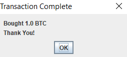
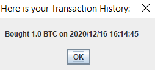
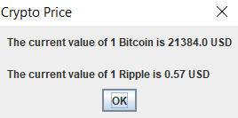

# BabyCrypto
An app that simulates buying and selling cryptocurrencies using US dollars.

## Task:
Create an effective recreation of popular cryptocurrency apps like Coinbase.

## Criteria
* Manage at least 3 types of currencies simultaneously
* Save history of purchases in a file and be able to load it
* Create a GUI to emulate app like structure
* Use an API to get actual cryptocurrency prices

## Final Product:
After downloading files, user can read menu in order to use the app.

Users can see their transaction, current wallet, and  history with simple commands.

The implemented API shows current price of Bitcoin and Ripple which were taken from Coinbase and other websites.

An Exit window is also included to serve as a confirmation of exiting the app correctly.

